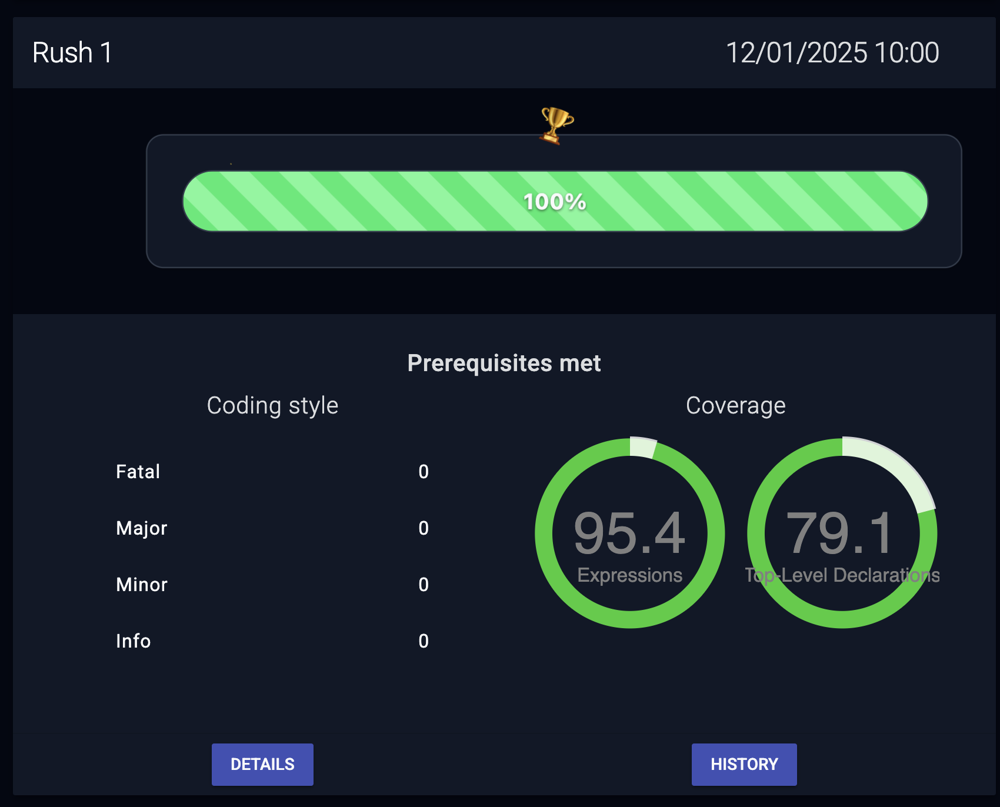
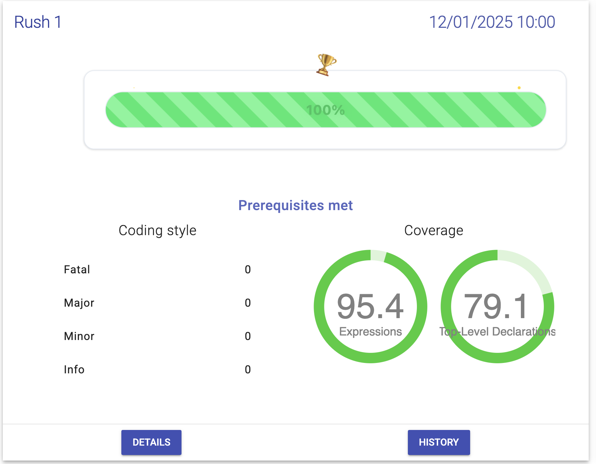
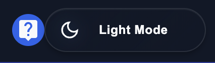
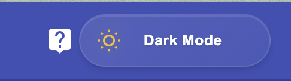
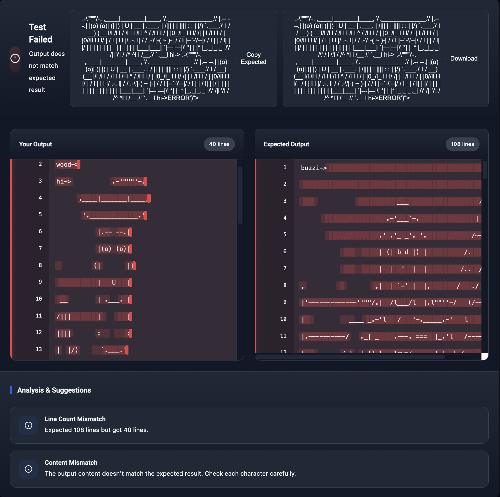

# 🚀 Epitech Enhanced Extension

> Transform your Epitech experience with intelligent test analysis and project tracking

## ✨ Features Showcase

### 🎯 Project Progress Tracking
<div align="center">
  
  <p><em>Real-time progress tracking with celebration animations and detailed metrics</em></p>
  
  <p><em>Clean, modern interface in both dark and light modes</em></p>
</div>

### 🌓 Smart Theme Switching
<div align="center">
  <div style="display: flex; gap: 20px; justify-content: center; margin-bottom: 20px;">
    
    
  </div>
  <p><em>Seamlessly switch between light and dark themes with system preference detection</em></p>
</div>

### 🔍 Intelligent Test Analysis
<div align="center">
  
  <p><em>Advanced diff viewer with smart analysis and quick fixes</em></p>
</div>

## 🎯 Quick Start

1. Install the extension from your browser's store:
   - [Chrome Web Store](https://chrome.google.com/webstore/detail/epitech-enhanced/...)
   - [Firefox Add-ons](https://addons.mozilla.org/en-US/firefox/addon/epitech-enhanced/)

2. Visit [my.epitech.eu](https://my.epitech.eu)
   - Progress bars will appear automatically
   - Test diffs will be enhanced automatically

3. Click the theme toggle in the top right to switch between light and dark modes

## 🛠 Features in Detail

### Smart Test Analysis

#### Intelligent Diff Viewer
- **Context-Aware Analysis**
  - Automatically detects common issues:
    - Whitespace differences
    - Case sensitivity
    - Missing/extra content
    - Character mismatches
  - Provides clear explanations and solutions

#### Interactive Features
- **Line-by-Line Analysis**
  - Hover hints showing exact differences
  - Quick copy of expected output
  - Detailed/compact view toggle
  - Key differences summary

#### Visual Aids
- **Enhanced Visualization**
  - Color-coded changes
  - Clear statistics
  - Intuitive icons
  - Responsive design

### Project Progress Tracking

#### Real-time Progress Bars
- **Visual Progress**
  - Percentage completion
  - Color-coded status
  - Automatic updates
  - Celebration animations

#### Project Stats
- **Detailed Metrics**
  - Tests passed/failed
  - Skills progress
  - Overall completion

## 🎨 Customization

### Theme Options
```javascript
// Toggle dark mode manually
localStorage.setItem('etd-dark-mode', 'true');

// Use system preferences
localStorage.removeItem('etd-dark-mode');
```

### View Preferences
```javascript
// Set default diff view mode
localStorage.setItem('etd-diff-view-mode', 'compact');
```

## ⌨️ Keyboard Shortcuts

| Action | Shortcut |
|--------|----------|
| Toggle Theme | `Ctrl/Cmd + Shift + T` |
| Copy Expected | `Ctrl/Cmd + Shift + C` |
| Toggle View Mode | `Ctrl/Cmd + Shift + V` |

## 🔒 Privacy & Security

- **Zero Data Collection**
  - All processing happens locally
  - No external services used
  - No tracking or analytics

- **Permissions Used**
  - `tabs`: For accessing test results
  - `storage`: For theme preferences
  - Host permissions:
    - `my.epitech.eu`: Main platform
    - `api.epitest.eu`: Project data

## 🤝 Contributing

1. Fork the repository
2. Create your feature branch
   ```bash
   git checkout -b feature/amazing-feature
   ```
3. Commit your changes
   ```bash
   git commit -m 'Add amazing feature'
   ```
4. Push to the branch
   ```bash
   git push origin feature/amazing-feature
   ```
5. Open a Pull Request

## 📝 License

This project is licensed under the MIT License - see the [LICENSE](LICENSE) file for details.
**thanks to @Sigmanificient for giving me the idea of ​​the diff view test feature in order to create a more complete extension**

## 🙏 Acknowledgments

- Thanks to all Epitech students who provided feedback
- Special thanks to contributors who helped improve the extension
- Inspired by the needs of the Epitech community

## 🐛 Troubleshooting

### Common Issues

1. **Progress bars not showing**
   - Refresh the page
   - Check if you're logged in
   - Clear browser cache

2. **Dark mode not working**
   - Check system theme settings
   - Try toggling manually
   - Clear local storage

3. **Diff viewer not appearing**
   - Click the test result again
   - Refresh the page
   - Check console for errors

### Getting Help

- Open an issue on GitHub
- Contact via [Discord](smokoxren)
- Email support: support@epitech-enhanced.dev

## 🚀 Future Plans

- [ ] AI-powered test analysis
- [ ] Project recommendations
- [ ] Performance analytics
- [ ] Team collaboration features
- [ ] Mobile app companion

Stay tuned for more amazing features!